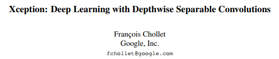
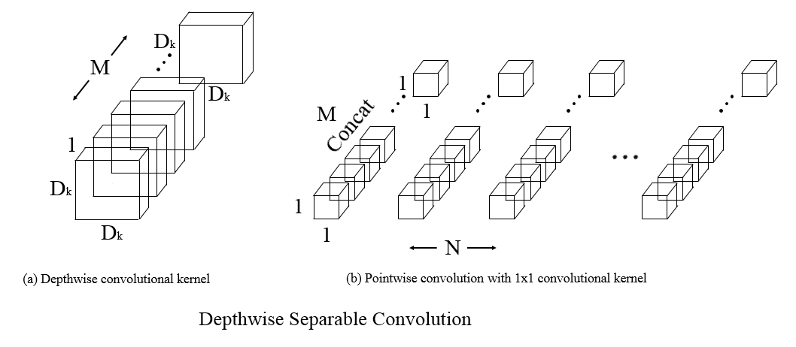

# A MXNet implementation of Xception

This is a [MXNet](http://mxnet.io/) implementation of Xception architecture as described in the paper [Xception: Deep Learning with Depthwise Separable Convolutions](http://openaccess.thecvf.com/content_cvpr_2017/papers/Chollet_Xception_Deep_Learning_CVPR_2017_paper.pdf)  proposed by François Chollet at CVPR 2017 from [google](https://research.googleblog.com/2017/07/google-at-cvpr-2017.html).

The author's keras implementation can be found in his [repo](https://github.com/fchollet/keras/blob/master/keras/applications/xception.py) on GitHub.

This is an illustration of Depthwise Separable Convolution with Depthwise convolution and Pointwise convolution.

M indicates the number of input feature map, N indicates the number of output channel.

This MXNet implementation is based on François Chollet's keras version. Furthermore, I also refered one implementation from [u1234x1234](https://github.com/u1234x1234/mxnet-xception), but my version is more compact. I also attach the training code if you want train your own data with Xception archetecuture by yourself. Of course, if you just want to use the pretrained model by keras with MXNet, you can refer the python code from [u1234x1234's repo](https://github.com/u1234x1234/mxnet-xception/blob/master/keras2mxnet.py).

In original paper, author deploys Xception on 60 NVIDIA K80 GPUs for training ImageNet dataset. The ImageNet experiments took approximately 3 days. However, I only have 4 GPUs. I'm afraid the computational effiency on MXNet. I'm not sure whether MXNet has any optimization for depthwise separable convolution or not. If there is some more efficient implementation or api from MXNet, please let me know. I'm appreciate for your kindness.

It is worth noting that I decrease the filter_list from [64, 128, 256, 728, 1024, 1536, 2048] (original version) to [64, 64, 128, 364, 512, 768, 1024] (smaller one). It is just because of computational efficency. Moreover, different from original version, I add dropout layer followed the last global average pooling layer.  

#Requirements

Install MXNet(0.8.0 or later version) on GPUs mechine with NVIDIA CUDA 8.0, and it's better also installed with [cuDNN v5](https://developer.nvidia.com/cudnn) or later version (I'm not testing cuDNN v7).

#Data

ImageNet'12 dataset

Imagenet 1000 class dataset with 1.2 million images. Because this dataset is about 120GB, so you have to download by yourself. Sorry for this inconvenience.

#How to Train

For data preparation, you can refer [my pervious part of densenet](https://github.com/bruinxiong/densenet.mxnet) or you can also visit the repo of [Wei Wu](https://github.com/tornadomeet/ResNet). In his page, there is a very detailed information about how to prepare your data. 

When you finised data preparation, please make sure the data locates the same folder of source codes. You also need to change path of path_imgrec in line 65 and line 89 of train_xception.py. Then you can run the training cmd just like this (here, I use 4 gpus for training):

python -u train_xception.py --data-dir data/imagenet --data-type imagenet --batch-size 256 --gpus=0,1,2,3

Maybe you should change batch-size from 256 to 128 due to the memory size of GPU.

#How to retrain

When we want to train the large dataset and hope to change learning rate manually, or the machine is suddenly shutdown due to some reason, of course, we definitely hope we can continue to train model with previous trained weights. Then, your can use this cmd:

python -u train_xception.py --data-dir data/imagenet --data-type imagenet --batch-size 256 --gpus=0,1,2,3 --model-load-epoch=50 --lr 0.001 --retrain

This means you can retrain your xception model from epoch 50 and change lr=0.001 using 4 GPU.

#Training curves

The training procedure is ongoing. The computational efficency is not optimistic. So, I hope anyone who are mxnet fun can test this code with me. When I finish, I will update more information about training and validation.

TO BE CONTINUE

#Reference

[1] François Chollet. "Xception: Deep Learning with Depthwise Separable Convolutions" http://openaccess.thecvf.com/content_cvpr_2017/papers/Chollet_Xception_Deep_Learning_CVPR_2017_paper.pdf

[2] Keras implementation of Xception from [François Chollet](https://github.com/fchollet/keras/blob/master/keras/applications/xception.py)

[3] MXNet implementation of Xception from [u1234x1234](https://github.com/u1234x1234/mxnet-xception)

